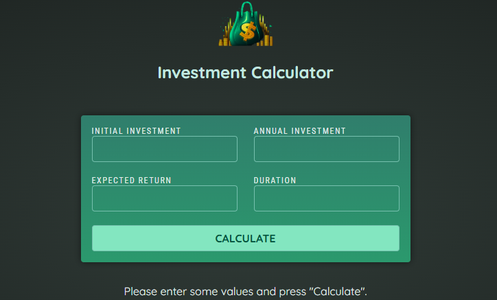
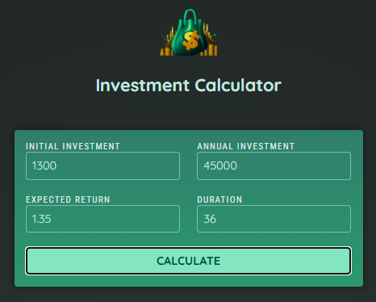
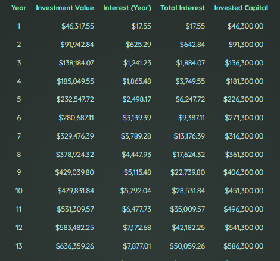

# 📈 Investment Calculator

A responsive and beginner-friendly investment calculator built with **Angular 19**, **TypeScript**, and **CSS**. This project allows users to simulate the growth of their investments over time based on user input values such as initial investment, annual contribution, expected return rate, and duration.


> 🌐 Live demo available at: [https://invests-calculator.netlify.app/](https://invests-calculator.netlify.app/)

<br/>



---

## 🚀 Features

- 📊 Dynamic investment projections based on real formulas
- ✍️ User-friendly form inputs for investment parameters
- 📈 Tabular display of yearly results with currency formatting
- ⚡ Built using Angular 19's **signals** and **standalone components**
- 📱 Responsive and clean layout with plain CSS

---

## 🧠 Tech Stack

| Technology | Version      | Purpose                      |
|------------|--------------|------------------------------|
| Angular    | 19.1.3       | Frontend framework           |
| TypeScript | ~5.7.2       | Type-safe JavaScript         |
| CSS        | Native       | Styling                      |

---

## 🗂️ Project Structure

```
public/
├── favicon.ico
└── investment-calculator-logo.png
src/
├── app/
│   ├── core/
│   │   └── services/
│   │       └── investment-calculator.service.ts
│   ├── features/
│   │   ├── results/
│   │   │   ├── results.component.\*
│   │   │   └── table-row\.model.ts
│   │   └── user-input/
│   │       ├── user-input.component.\*
│   │       └── input-data.model.ts
│   └── shared/components/header/
│       └── header.component.\*
│   ├── app.component.\*
│   ├── app.config.ts
│   ├── app.routes.ts
├── main.ts
├── index.html
└── styles.css
```

---

## 🧮 How It Works

- The user fills out an input form with:
  - Initial investment amount
  - Annual contribution
  - Expected return rate (in %)
  - Investment duration (in years)

- When the form is submitted:
  - The `InvestmentCalculatorService` processes the data
  - The result for each year is calculated and inserted into an array
  - The results are retrieved by the `ResultsComponent` and displayed in a formatted table

---

## 📷 Screenshots





---

## 🛠️ Getting Started

### Prerequisites

- Node.js (v18+ recommended)
- Angular CLI

### Installation

```bash
# Clone the repository
git clone https://github.com/dihcoder/investment-calculator.git

# Navigate to the project folder
cd investment-calculator

# Install dependencies
npm install

# Run the development server
ng serve
```

Visit `http://localhost:4200/` to start using the app.

---

## 📚 Learnings & Highlights

* Practiced building **modular architecture** with `core`, `features`, and `shared` folders
* Used **Angular standalone components** to reduce boilerplate
* Implemented **Angular Signals API** for reactive state management
* Utilized **typed models** for clean data handling

---

## 📦 Future Improvements

* Add charts (e.g. bar/line) to visualize investment growth
* Improve mobile responsiveness and UI
* Enable currency switch (USD, EUR, BRL, etc.)
* Add validation and better error handling
* Support light/dark mode

---

## 👨‍💻 Author

Made with ❤️ by **Diego**

> *Student & aspiring Full Stack Developer*

[](https://linkedin.com/in/dihcoder)
[](https://dihcoder.github.io/personal-website/)

---

## 📄 License

This project is licensed under the MIT License. See the [LICENSE](LICENSE) file for details.
